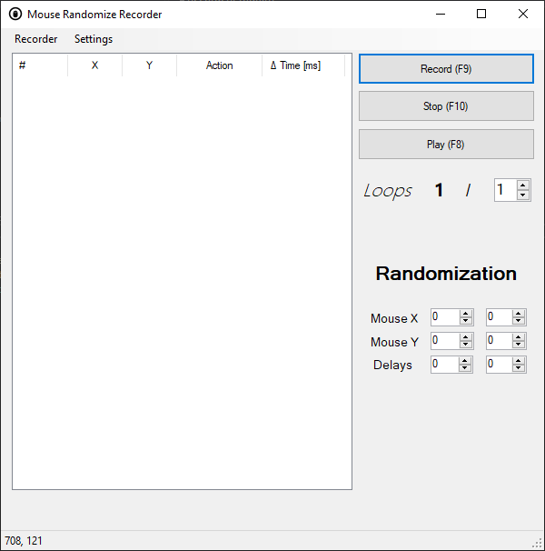

# Randomize Mouse Recorder

## Functionality
- Record and replay mouse movement/input keys
- User can specific number of replays
- Unlimited replays supported (infinite loop)
- Clicks can be randomized (by px offset)
- Delays can randomized (by given ms)
- Hotkeys F8-10 to control the program
- Current cursor position 

## GUI


## Road map
✅ MouseRecorder released

🕓 Custom settings

🕓 Ediable list of commands

## Distribution
Repo is a copy Visual Studio 2019 project that needs to compiled into a executable file (.exe). Recorder focuses on Windows environment.

```
MouseRecorder.exe
```

## Issues
Kindly, open an issue here on GitHub.


## License